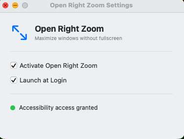

# Open Right Zoom

Free macOS utility that makes the green zoom button maximize windows instead of going fullscreen — Dock and menu bar stay visible.

> Free alternative to Right Zoom for Mac, BetterZoom, and Magnet.

<p align="center">
  
</p>

## What it does

Click the green button → window fills the screen (excluding Dock and menu bar)
Click again → window restores to its previous size
Hold any modifier key (⌘ ⌃ ⇧ ⌥) → standard macOS fullscreen behavior

Works with any app: Finder, Safari, Terminal, VS Code, Chrome, etc.

## Install

1. Download `OpenRightZoom-vX.X.X.zip` from [Releases](../../releases/latest)
2. Move `OpenRightZoom.app` to `/Applications`
3. Remove the quarantine flag (required for unsigned apps):
   ```bash
   xattr -cr /Applications/OpenRightZoom.app
   ```
4. Launch the app and grant Accessibility access when prompted

## Requirements

- macOS 13 Ventura or later

## Build from source

```bash
git clone https://github.com/Michele0303/open-right-zoom
open OpenRightZoom.xcodeproj
# Cmd+R to build and run
```

## License

MIT
