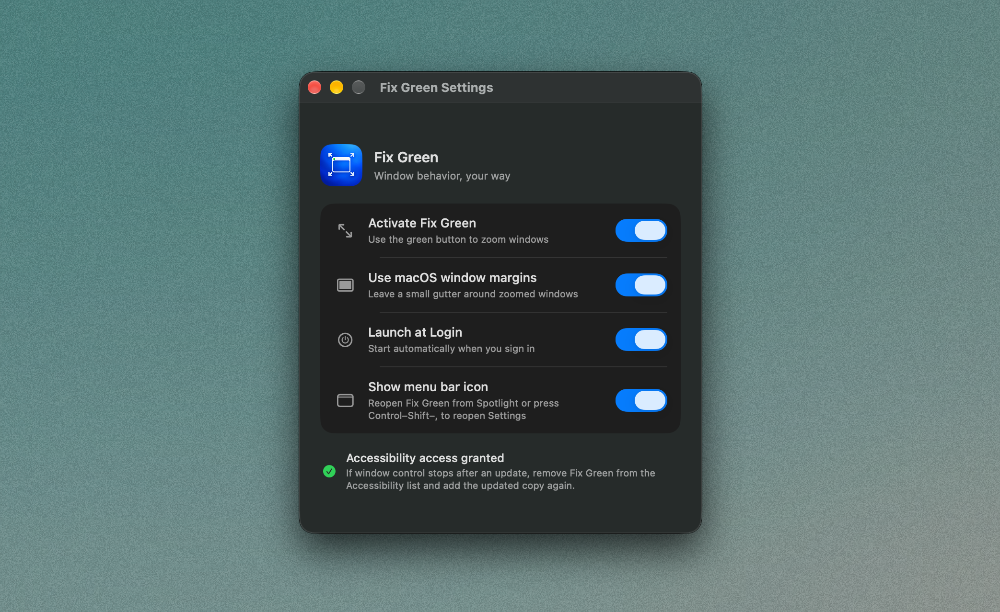

# Fix Green

Fix Green changes what happens when you click a window's green button: it zooms the window to the usable part of your screen, without moving it to a separate full-screen space. Click again to put it back.

This started as a fork of [Open Right Zoom](https://github.com/Michele0303/open-right-zoom) by Michele0303. It keeps the original idea and adds a few options for how it behaves.

<p align="center">
  
</p>

## Download Fix Green

> **[Download the latest version from GitHub Releases](https://github.com/nikgraphx/FixGreen/releases/latest)**
>
> On the release page, open **Assets** and choose **Fix-Green-v*.zip**. It contains the app. The separate “Source code” downloads are just the project files.

Unzip it and move **Fix Green.app** to **Applications** before opening it.

## First launch and how to use it

1. Open **Fix Green.app** from Applications. If macOS blocks it, Control-click the app and choose **Open**.
2. In **System Settings → Privacy & Security → Accessibility**, turn on **Fix Green**. If it is not listed, add **Fix Green.app** from Applications with the **+** button.
3. Open a window and click its green button. Fix Green zooms it to the usable area of your screen; click the green button again to restore its previous size.

To use macOS's regular full-screen mode for a window, hold **Command** while clicking its green button.

## A few things you can do

- Leave a little space around zoomed windows, or turn margins off.
- Click the green button again to restore the window's old size.
- Hold a modifier key to get the usual macOS full-screen behavior.
- Press **Control–Shift–Z** to zoom the active window.
- Set Fix Green to open at login. The menu bar icon is optional; open Fix Green from Spotlight to get back to Settings if you hide it.
- Choose **Check for Updates** in the menu when you want to see if a new version is out.

## Accessibility permission

After opening the app, add that copy to **System Settings → Privacy & Security → Accessibility** and turn it on. Fix Green needs this permission to resize windows in other apps; macOS requires you to grant it yourself.

If window resizing stops after you install an update, remove Fix Green from the Accessibility list and add the updated app again. macOS can remember permission for a particular copy of an ad-hoc-signed app.

The download is not notarized by Apple, so macOS may show a warning the first time. If it blocks the app, Control-click **Fix Green.app** in Applications and choose **Open**.

## Requirements

- macOS 13 Ventura or later
- Apple Silicon or Intel Mac

## Build it yourself

Install Xcode, then:

```sh
git clone https://github.com/nikgraphx/FixGreen.git
cd FixGreen
open OpenRightZoom.xcodeproj
```

Choose the `OpenRightZoom` scheme in Xcode. To build a universal Release app from Terminal:

```sh
xcodebuild \
  -project OpenRightZoom.xcodeproj \
  -scheme OpenRightZoom \
  -configuration Release \
  -destination 'platform=macOS' \
  ARCHS='arm64 x86_64' \
  ONLY_ACTIVE_ARCH=NO \
  build
```

## Releases

Each release has a short entry in [CHANGELOG.md](CHANGELOG.md). Pushing a version tag starts a GitHub Actions build that compiles the app for Apple Silicon and Intel, puts it in a ZIP, and attaches the ZIP to the release.

## Where it came from

Fix Green is based on [Open Right Zoom](https://github.com/Michele0303/open-right-zoom). The original MIT license and copyright notice are kept in [LICENSE](LICENSE); please keep them with copies of the software. Fix Green's changes are available in this repository under the MIT license as well.

## Help and security reports

For help, email [nikgraphx@gmail.com](mailto:nikgraphx@gmail.com?subject=Fix%20Green%20help), or find me on [X](https://x.com/nikgraphx). Please report security issues privately; the instructions are in [SECURITY.md](SECURITY.md).
